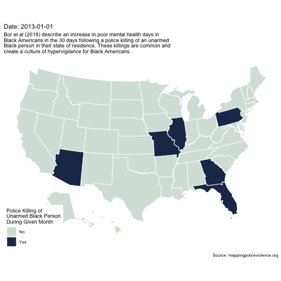

# police-killings-unarmed-black-people-us-map
Bor et al (2018) describe an increase in poor mental health days in Black Americans in the 30 days following a police killing of an unarmed Black person in their state of residence. This map shows monthly police killings of unarmed black people by US state.

 / ! 
